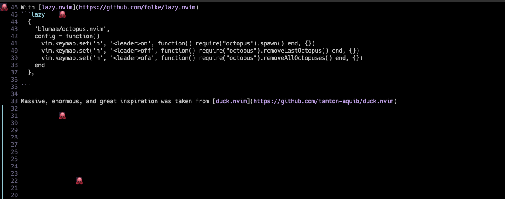

## Ohne Accidents

this is a simple and stupid plugin that makes random octupi dance across your IDE.



With [lazy.nvim](https://github.com/folke/lazy.nvim)
```lazy
  {
    'blumaa/octopus.nvim',
    config = function()
      vim.keymap.set('n', '<leader>on', function() require("octopus").spawn() end, {})
      vim.keymap.set('n', '<leader>off', function() require("octopus").removeLastOctopus() end, {})
      vim.keymap.set('n', '<leader>ofa', function() require("octopus").removeAllOctopuses() end, {})
    end
  },

```

Massive, enormous, and great inspiration was taken from [duck.nvim](https://github.com/tamton-aquib/duck.nvim)
